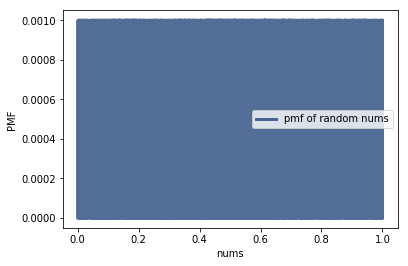

[Think Stats Chapter 4 Exercise 2](http://greenteapress.com/thinkstats2/html/thinkstats2005.html#toc41) (a random distribution)

# Exercise 4.2  
## The numbers generated by random.random are supposed to be uniform between 0 and 1; that is, every value in the range should have the same probability. Generate 1000 numbers from random.random and plot their PMF and CDF. Is the distribution uniform?

    nums = [r.random() for i in range(1000)]

    rn_pmf = thinkstats2.Pmf(nums)
    thinkplot.Pmf(rn_pmf, label='pmf of random nums')
    thinkplot.Show(xlabel='nums', ylabel='PMF')

 
    rn_cdf = thinkstats2.Cdf(nums)
    thinkplot.Cdf(rn_cdf)
    thinkplot.Show(xlabel='percentile rank', ylabel='CDF')

**yes, it is a uniform distribution**